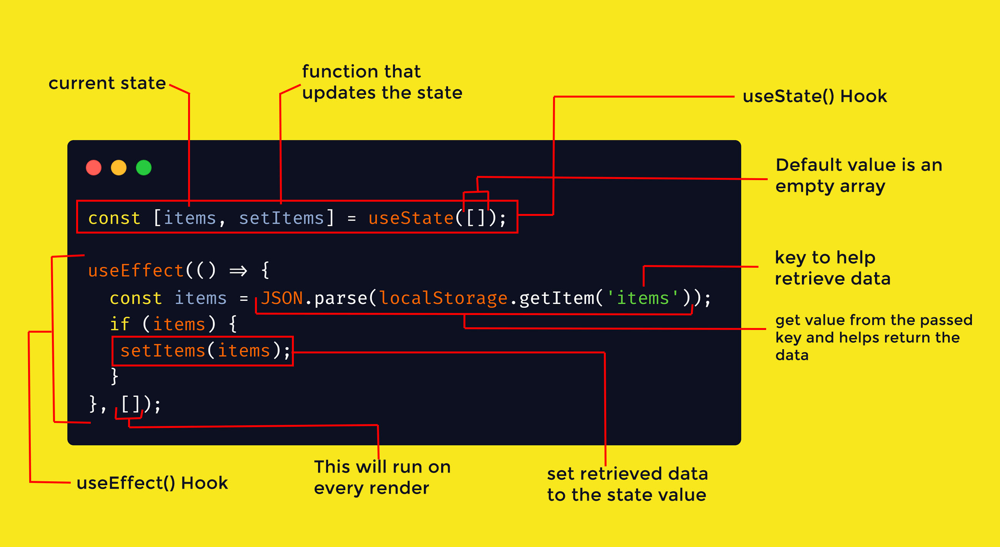

# React + Vite : TodoList

First React App. TodoList with the following features :

- Add Tasks
- Check Tasks Done
- Delete tasks

## SetUp

```sh
npm create vite@latest
```

## What I learned

### Spread operator :

The spread operator (...) is a feature in JavaScript that allows to expand or spread the contents of an iterable (such as an array or an object) into another iterable. It's commonly used to create shallow copies of arrays or objects, combine arrays, pass function arguments, and more. Here's a breakdown of how the spread operator works:

1. Copying Arrays:

```js
const originalArray = [1, 2, 3];
const newArray = [...originalArray]; // Creates a new array with the same elements
```

2. Combining Arrays:

```js
const array1 = [1, 2, 3];
const array2 = [4, 5, 6];
const combinedArray = [...array1, ...array2]; // Combines elements from both arrays
```

2. Copying Objects:

```js
const originalObject = { key1: "value1", key2: "value2" };
const newObject = { ...originalObject }; // Creates a new object with the same properties
```

4. Merging Objects:

```js
const object1 = { key1: "value1" };
const object2 = { key2: "value2" };
const mergedObject = { ...object1, ...object2 }; // Merges properties from both objects
```

5. Function Arguments:

```js
function addThreeNumbers(a, b, c) {
  return a + b + c;
}
const numbers = [1, 2, 3];
const sum = addThreeNumbers(...numbers); // Passes each element as an argument
```

6. Function Arguments:

```js
const originalArray = [1, 2, 3];
const copyArray = [...originalArray];
copyArray.push(4); // Only affects the copy, not the original
```

### Explaining JSX Conditional Rendering

In JSX (JavaScript XML), we can conditionally render content using a concise syntax. This is often used in React components to display different elements based on certain conditions.

Consider the following JSX expression within a React component:

```jsx
{
  todos.length === 0 && "No Todos";
}
```

- `todos.length === 0`: This part of the expression checks whether the length of the `todos` array is equal to 0. In other words, it checks if the array is empty.

- `&&`: The `&&` operator is the logical AND operator. It is used to combine two expressions and returns `true` if both expressions are `true`.

- `"No Todos"`: This is a string literal that serves as the value to be returned if the condition is true (i.e., if `todos.length === 0` is true). In this case, it represents the text "No Todos" that you want to display when there are no todos.

Here's how the expression works:

1. If `todos.length` is equal to 0 (the array is empty), then the left side of the `&&` operator evaluates to `true`.

2. Since the left side is `true`, the right side of the `&&` operator is evaluated as well.

3. The right side of the `&&` operator is `"No Todos"`, which is a non-empty string. In JavaScript, non-empty strings are considered "truthy" values.

4. The entire expression evaluates to the truthy value `"No Todos"`.

5. As a result, `"No Todos"` will be rendered as content within the JSX element if the `todos` array is empty.

### Generating Unique IDs with crypto.randomUUID()

allows you to generate Universally Unique Identifiers (UUIDs) in a random manner.

```jsx
const uniqueId = crypto.randomUUID();
console.log("Generated UUID:", uniqueId);
```

### Use of Hooks and Localstorage


